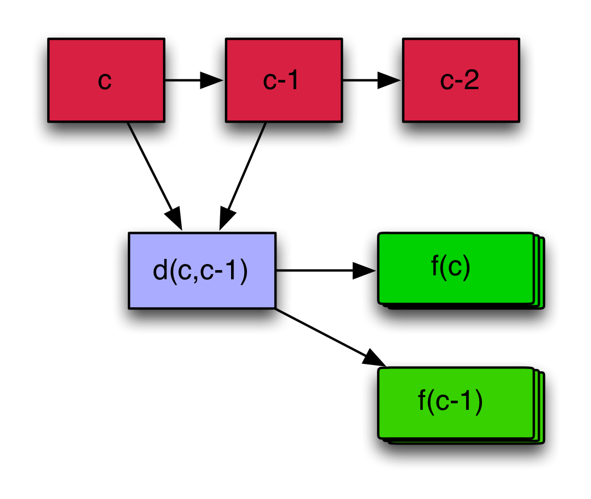
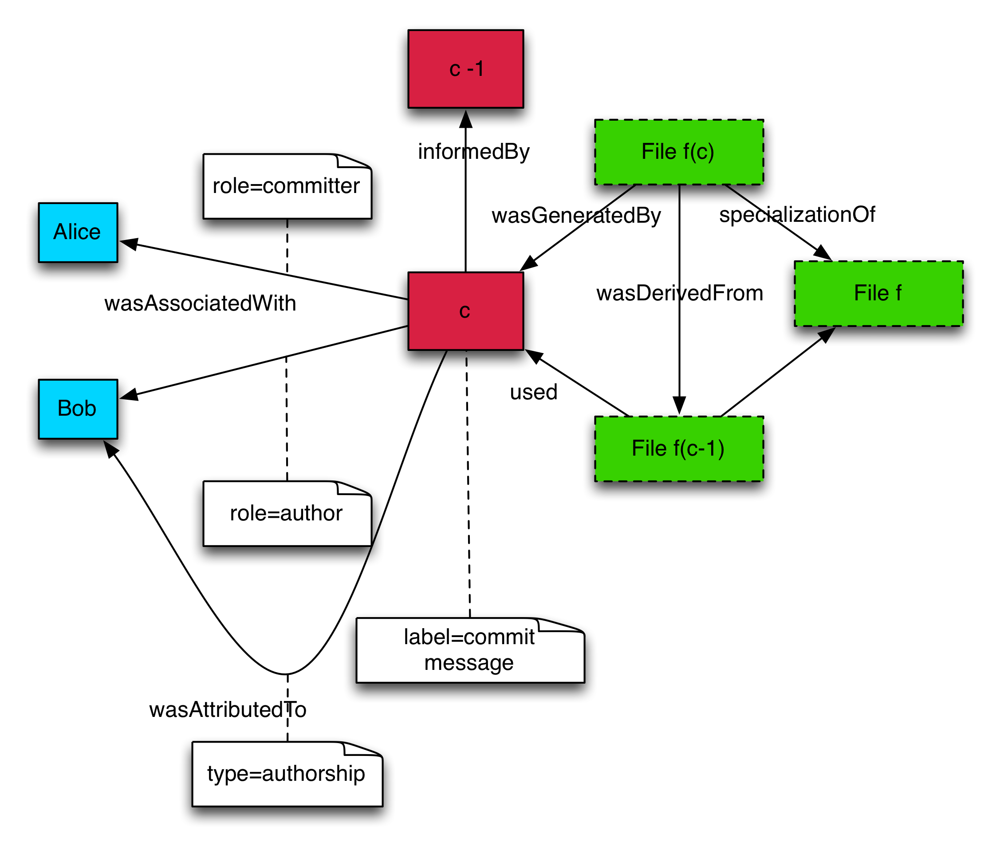
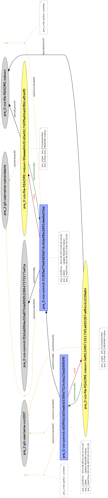

Yeah ok

---
sansfont: 'Old Style 7 Std'
mainfont: 'Old Style 7 Std'
monofont: 'Pragmata'
title:  'Semantic content production with plain-text and git'
abstract: |
    Plain-text files and a modern version control system can be used to create a content repository and publishing pipeline. Version control history can be translated into standard compliant W3C provenance graphs. Semantics can be embedded in plain-text content directly, inferred from structure or stored as annotations. Print quality documents and web content can be producted from semantic data as the version control system is updated.

...

## Engineering versus office model of document production

It is possible to separate approaches to collaboratively constructing documents into two camps [@Plaintext_Please] - the office model and the engineering model. The office model is familiar to most people; a set of tools centered around a word processor and a number of large files are the center of their work. Changes to this work are tracked inside these large files and in various ad-hoc ways. Concurrent editing is difficult unless authors are in the same room and merging changes between different groups working concurrently is usually a manual process. The final output is usually the word processor file without change tracking data, possibly transliterated to formats more suitable for print or web.

In the engineering model, a larger number of plaintext files and a version control system become the center of the project along with a larger suite of more specific tools than a word processor. Changes to these files are tracked externally, in the version control system. Plain text formats are used because of the relative ease of determining the differences between two versions of the same text. Transformation of plain-text is usually performed by different tools than those used for editing it.

## Plain-text

Files that contain markup or other data are generally considered plain-text, as long as the entirety remains in directly human-readable form. Markup formats such as HTML and markdown are also plain-text as Coombs, Renear, and DeRose argue [@Coombs:1987:MSF:32206.32209], punctuation is itself markup. A binary file (such as a JPEG image or a Word Document) is a sequence of bytes which requires interpretation before it can be understood by humans. Some rich text formats such as Microsoft Word's .xdoc are superficially plain-text but are probably better classed as text encoded binary formats as very few humans would be able to make sense of such a document without the application that renders it.

A consideration when choosing between plain-text formats is the ease of resolving conflicts when multiple agents are collaborating on changes to a single file. Line and character oriented differencing algorithms are efficient and well understood. Differencing rich text formats that have structures that span multiple lines such as HTML or XML is more complex. Using textual differencing on these can produce invalid results and relies on users having knowledge of the format to resolve problems. These same constrains apply to the operational transformation algorithms [@Sun98operationaltransformation] that collaborative real-time editors use.

## Version control systems

Version control systems (VCS) capable of accurately and efficiently working with files containing plain text data have a long history in computing [@History_VCS]. They are used day to day by millions of people to collaboratively develop complex projects. The complexity of some projects that rely on VCS is remarkable - the Linux operating system has nearly half a million recorded changes, 4000 current contributors and contains 15 million lines of text distributed between 40,000 files [@Linux_Project]. This text is regularly compiled into an operating system that is used everywhere from mobile phones to the Mars rover.

## Provenance

>Provenance is information about entities, activities, and people involved in producing a piece of data or thing, which can be used to form assessments about its quality, reliability or trustworthiness [@McGuinness:13:PTP].
 
Provenance is particularly important to the semantic web community as they need to track the complicated web of trust between linked data sources. To meet these needs, the W3C published the PROV standard.

The PROV data model supports the following:

* The core concepts of identifying an object, attributing the object to person or entity, and representing processing steps
* Accessing provenance-related information expressed in other standards
* Accessing provenance
* The provenance of provenance
* Reproducibility
* Versioning
* Representing procedures
* Representing derivation

## Provenance extraction from version control

The Git2Prov project [@denies_iswc_2013] demonstrates a model for extracting PROV from a git repository. A altered version of this model is presented here that demonstrates the core concepts.

A git repository with no branches can be viewed as a sequence of linked commits. Each commit contains the complete repository state at that point and has a unique hash code along with metadata describing the change and identifying the users involved. A diff can be created for any pair of commits that will show altered, added, renamed and copied files.

To translate from this to the PROV data model we use the following process:

* Commits are grouped into pairs for differencing from the most current to oldest with the oldest commit compared against the empty commit $\epsilon$. This produces a sequence of commit pairs:

$$ (c_{n},c_{n-1}) \ldots (c_{0},\epsilon) $$

* A diff is taken between each commit in a pair and associated with the first commit in the pair producing:

$$ (c_{n},d(c_{n},c_{n-1})) \ldots (c_{0},d(c_{0},\epsilon))  $$

* Each diff / commit pair is then processed into statements that can be appended to a provenance graph. The commit pairs are then processed into triples as follows:

For the commit:

~~~~ {.ttl}

vcs:commit-{c.SHAHash} a prov:Activity 
  rdfs:label '{c.CommitMessage}' ;
  prov:startedAtTime {c.Author.Time} ;   
  prov:endedAtTime {c.Commit.Time} ;
  prov.wasAssociatedWith vcs:git-user-{c.Commit.User} ;  
  prov.wasInformedBy vcs:commit-{c.Commit.ParentCommit.SHAHash} ;
  prov.qualifiedAssociation 
    [
      a prov:Association ;
      prov:agent vcs:git-user{c.Commit.User} ;
      prov:hadRole "author, comitter" ;
    ]
~~~~

For each changed file in the commit:

~~~~ {.ttl}

vcs:file-{f.SHAHash}-{f.FilePath} a prov:Entity,content:ContentAsText ;
  content:chars {git repository http uri}{f.FilePath}-{f.ShaHash} ;
  prov:specializationOf {git repository http uri}{f.FilePath} ;
  prov:wasAttributedTo vcs:git-user-{f.User} ;
  prov:wasGeneratedBy vcs:commit-{c.SHAHash} ;

vcs:commit-{c.SHAHash} prov:uses cs:file-{f.SHAHash}-{f.FilePath} ;

~~~~

Figure 2 shows the structure of the RDF produced by this algorithm.

Extracting PROV from a git repository with a simple history of multiple edits to a single file results in the PROV graph shown in Figure 3.

## Documents and content as process output

In this engineering model of content production, documents and other forms of content are a process output. Producing outputs becomes similar to processes used in software development. Changes to the version control system trigger processes that create outputs. If this model were used for pathway production:

* Keeping the current setup of 3 environments - development, preview and live. Each would have access to a web server that serves static content. The development environment also has tools to edit content. They all share a git repository.

* Each commit to the git repository triggers a build process that extracts PROV and appends to NICE's provenance graph stored in a triple store. This build process also produces .pdf and html versions of the changed pathways and uploads them to the shared web server. These can be accessed by using the correct git hash in the URI, allowing access to all historical versions of pathways.

* Preview users are sent the URI to the exact version they need to comment on.

* On a major pathway release, the pathways development branch is merged to master and a tag is created. This triggers the same compilation process but also sets the default pathway version shown to the public to these newly created artifacts.

We have built prototypes that demonstrate these principles. A pipeline that produces a print quality document that resembles guidance with superior typesetting than is available in Microsoft Word, content for the pathways website and processes for extracting PROV from git. This document was itself produced using the principles outlined here.
